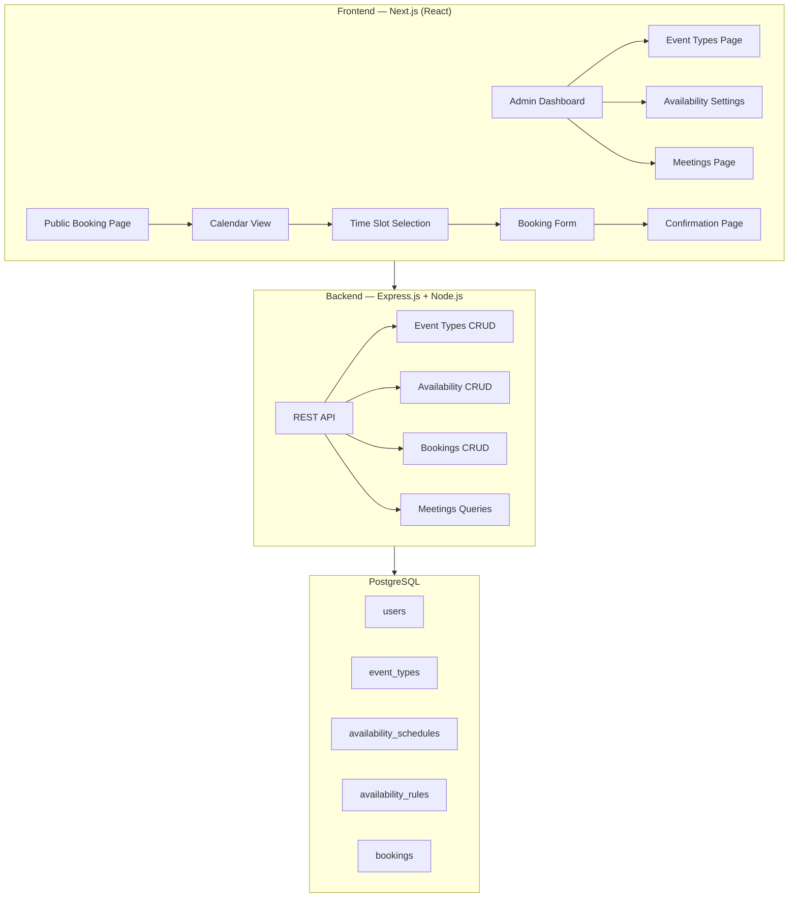
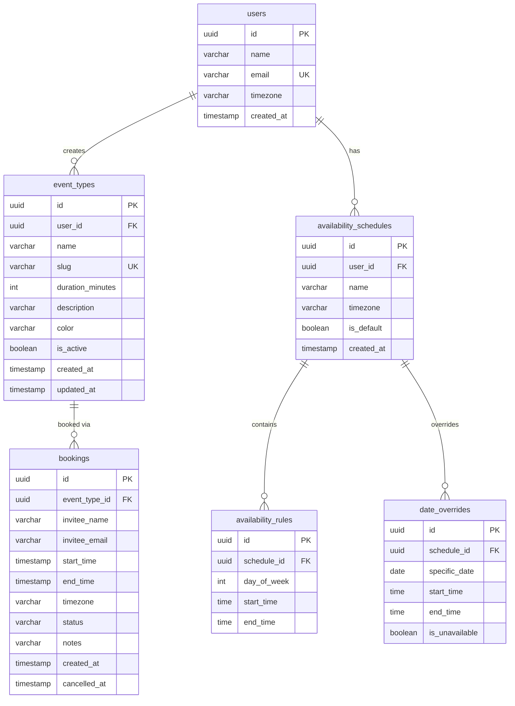

# Calendly Clone — Implementation Plan

## Overview

Build a full-featured scheduling/booking web application that replicates Calendly's design and UX. The app allows a default user to create event types, set availability, and lets the public book time slots through a public booking page.

## Architecture



## Tech Stack

| Layer | Technology | Rationale |
|-------|-----------|-----------|
| Frontend | **Next.js 15** (App Router, React 19) | Modern React framework, SSR, file-based routing |
| Styling | **Vanilla CSS** with CSS custom properties | Full design control, no framework bloat |
| Backend | **Express.js** on Node.js | Assignment requires Express as an option; clean REST API |
| Database | **Supabase** (PostgreSQL) | Free tier, managed PostgreSQL, connection pooling |
| ORM | **Prisma** | Type-safe queries, migrations, seeding |
| Timezone | **date-fns** + **date-fns-tz** | Reliable date/time handling |
| HTTP Client | **fetch** (built-in) | No extra deps needed for Next.js |
| Deployment | **Vercel** (frontend) + **Render** (backend) | Free tier, easy setup |

---

## Database Schema



> [!IMPORTANT]
> All timestamps stored in **UTC**. Timezone conversion happens on the client side using the user's browser timezone or the selected timezone.

---

## API Design

### Event Types

| Method | Endpoint | Description |
|--------|----------|-------------|
| `GET` | `/api/event-types` | List all event types for the default user |
| `GET` | `/api/event-types/:slug` | Get event type by slug (public booking) |
| `POST` | `/api/event-types` | Create a new event type |
| `PUT` | `/api/event-types/:id` | Update an event type |
| `DELETE` | `/api/event-types/:id` | Delete an event type |

### Availability

| Method | Endpoint | Description |
|--------|----------|-------------|
| `GET` | `/api/availability` | Get default availability schedule |
| `PUT` | `/api/availability` | Update availability rules |
| `GET` | `/api/availability/:slug/:date` | Get available time slots for a date (public) |

### Bookings

| Method | Endpoint | Description |
|--------|----------|-------------|
| `POST` | `/api/bookings` | Create a new booking |
| `GET` | `/api/bookings?type=upcoming` | List upcoming meetings |
| `GET` | `/api/bookings?type=past` | List past meetings |
| `PATCH` | `/api/bookings/:id/cancel` | Cancel a booking |

---

## Frontend Pages & Components

### Pages

| Route | Page | Description |
|-------|------|-------------|
| `/` | Dashboard | Admin home — lists event types |
| `/event-types/new` | Create Event | Form to create a new event type |
| `/event-types/[id]/edit` | Edit Event | Form to edit an event type |
| `/availability` | Availability | Set weekly availability schedule |
| `/meetings` | Meetings | Tabbed view of upcoming/past meetings |
| `/booking/[slug]` | Public Booking | Calendar → time slots → form → confirmation |

### Key UI Components

1. **Sidebar Navigation** — persistent left nav (Event Types, Availability, Meetings)
2. **EventTypeCard** — card showing event name, duration, link, copy-link action
3. **CalendarWidget** — month calendar grid with available date highlighting
4. **TimeSlotList** — scrollable list of available time buttons
5. **BookingForm** — name, email, optional notes
6. **ConfirmationView** — success display with meeting details
7. **MeetingCard** — meeting info with cancel action

### Design System (Matching Calendly)

```
Primary Blue:    #006BFF
Text Dark:       #1A1A1A
Text Secondary:  #4D5159
Border Light:    #E5E7EB
Background:      #F8F9FA
Card Background: #FFFFFF
Success Green:   #00A854
Error Red:       #E5484D
Font Family:     'Inter', sans-serif
Border Radius:   8px (cards), 50% (calendar dates)
```

---

## Implementation Phases

### Phase 1: Project Scaffolding (~30 min)
- [x] Initialize Next.js frontend project
- [x] Initialize Express.js backend project
- [x] Set up PostgreSQL with Prisma
- [x] Configure project structure, ESLint, scripts

### Phase 2: Backend API (~2 hours)
- [ ] Define Prisma schema with all tables
- [ ] Run migrations
- [ ] Create seed data (default user, sample events, sample bookings)
- [ ] Implement Event Types CRUD endpoints
- [ ] Implement Availability endpoints
- [ ] Implement Booking endpoints with double-booking prevention
- [ ] Implement Meetings query endpoints

### Phase 3: Frontend UI (~4 hours)
- [ ] Build global CSS design system
- [ ] Build Sidebar layout component
- [ ] Build Event Types dashboard page
- [ ] Build Create/Edit Event Type forms
- [ ] Build Availability Settings page
- [ ] Build Meetings page with tabs
- [ ] Build Public Booking flow (calendar → slots → form → confirmation)

### Phase 4: Integration & Polish (~1.5 hours)
- [ ] Connect all frontend pages to backend API
- [ ] Add loading states, error handling, toast notifications
- [ ] Add responsive design (mobile/tablet)
- [ ] Add micro-animations and transitions
- [ ] Cross-browser testing

### Phase 5: Deployment & Documentation (~30 min)
- [ ] Deploy backend to Render
- [ ] Deploy frontend to Vercel
- [ ] Write comprehensive README.md
- [ ] Seed production database

---

## Project Structure

```
calendly-clone/
├── frontend/                   # Next.js app
│   ├── src/
│   │   ├── app/
│   │   │   ├── layout.js
│   │   │   ├── page.js         # Dashboard (Event Types)
│   │   │   ├── event-types/
│   │   │   │   ├── new/page.js
│   │   │   │   └── [id]/edit/page.js
│   │   │   ├── availability/page.js
│   │   │   ├── meetings/page.js
│   │   │   └── booking/[slug]/page.js
│   │   ├── components/
│   │   │   ├── Sidebar.js
│   │   │   ├── EventTypeCard.js
│   │   │   ├── CalendarWidget.js
│   │   │   ├── TimeSlotList.js
│   │   │   ├── BookingForm.js
│   │   │   ├── ConfirmationView.js
│   │   │   ├── MeetingCard.js
│   │   │   └── Modal.js
│   │   ├── lib/
│   │   │   └── api.js          # API client helper
│   │   └── styles/
│   │       └── globals.css
│   └── package.json
│
├── backend/                    # Express.js API
│   ├── src/
│   │   ├── index.js            # Server entry
│   │   ├── routes/
│   │   │   ├── eventTypes.js
│   │   │   ├── availability.js
│   │   │   └── bookings.js
│   │   ├── controllers/
│   │   │   ├── eventTypeController.js
│   │   │   ├── availabilityController.js
│   │   │   └── bookingController.js
│   │   └── middleware/
│   │       └── errorHandler.js
│   ├── prisma/
│   │   ├── schema.prisma
│   │   └── seed.js
│   └── package.json
│
├── docs/
│   └── Scaler_SDE_Intern_Fullstack_Assignment_-_Calendly_Clone.md
└── README.md
```

---

## Decisions Made

- ✅ **Database**: Supabase free tier (managed PostgreSQL)
- ✅ **Deployment**: Vercel (frontend) + Render (Express backend) + Supabase (DB)
- ✅ **Bonus features**: Build MVP first, then add email notifications, buffer time, rescheduling

---

## Verification Plan

### Automated
- Seed database with sample data and verify all CRUD endpoints via `curl`/Postman
- Browser-based testing of the full booking flow
- Test double-booking prevention

### Manual
- Visual comparison with Calendly screenshots
- Mobile responsive testing via browser DevTools
- Deploy to staging and test the public booking flow end-to-end
